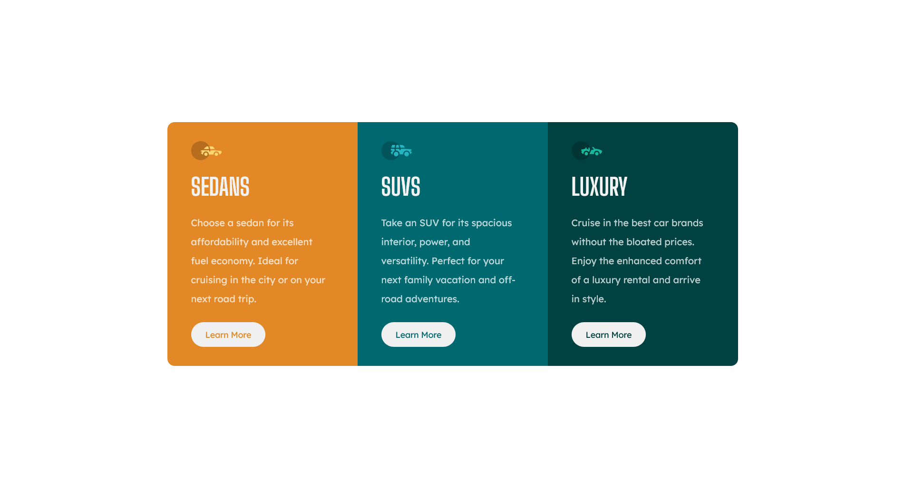

# Frontend Mentor - 3-column preview card component solution

This is a solution to the [3-column preview card component challenge on Frontend Mentor](https://www.frontendmentor.io/challenges/3column-preview-card-component-pH92eAR2-). Frontend Mentor challenges help you improve your coding skills by building realistic projects. 

## Table of contents

- [Overview](#overview)
  - [The challenge](#the-challenge)
  - [Screenshot](#screenshot)
  - [Links](#links)
- [My process](#my-process)
  - [Built with](#built-with)
  - [What I learned](#what-i-learned)
  - [Continued development](#continued-development)
  
## Overview

### The challenge

Users should be able to:

- View the optimal layout depending on their device's screen size
- See hover states for interactive elements

### Screenshot

### Links

- Solution URL: [Add solution URL here](https://your-solution-url.com)
- Live Site URL: [Add live site URL here](https://your-live-site-url.com)

## My process
  Started with mobile interface before desktop since it's easier to manage and build CSS on mobile interfaces. Finished HTML, moved to layout, then finished the project with styling and responsiveness.
### Built with

- CSS custom properties
- CSS Grid
- Mobile-first workflow
- CSS clamp() function

### What I learned

I learned how to use clamp() to my advantage, especially when doing the responsiveness part of CSS.

### Continued development

I'd want to focus on learning shorthand versions of my code to make it cleaner and shorter. Also I'd like to further improve my skills on Responsive CSS.